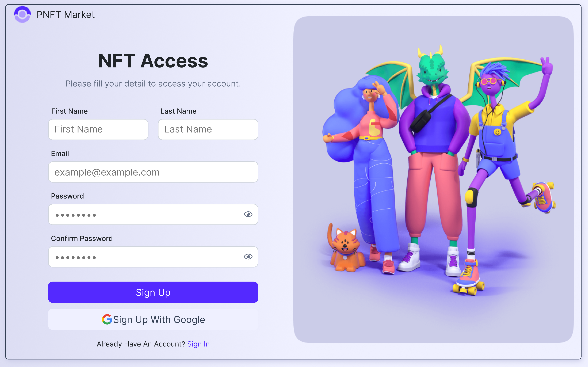

<h2>About the project</h2>

  
A <b>PNFT Market</b> website is an online platform that allows users to buy images for personal use. This is a Sign in and Sign up page for PNFT Market. A NFT is Non-fungible token. “Non-fungible” more or less means that it’s unique and can’t be replaced with something else.

👉 Live Demo: <a href='https://pnft-market.vercel.app/' target="_blank">Live Demo</a>

<h3>Build with:</h3>

» Bootstrap  
» React JS

<h2>Screenshots of the Project 📸</h2>
 
<h3 align='center'>Login Page 🏡</h3>

<h3 align='center'>Sign Up Page 🏡</h3>

