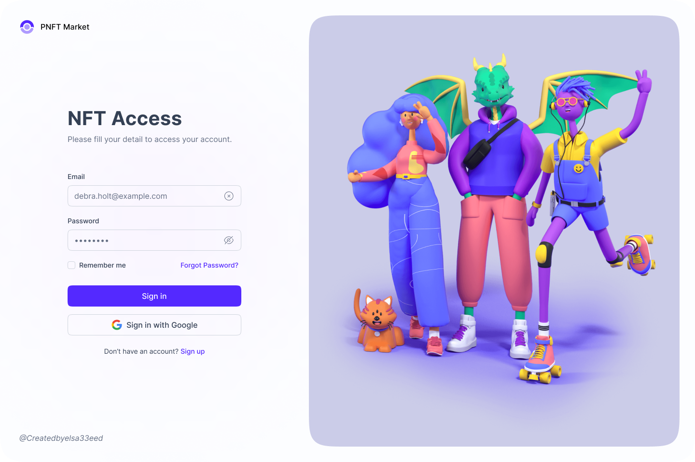

<h2>About the project</h2>

  
A <b>PNFT Market</b> website is an online platform that allows users to buy images for personal use. The website provides an easy-to-use interface for searching, comparing, and reserving NFT from a wide selection of images that vary in design, size, and price.

👉 Live Demo: <a href='https://pnft-market.vercel.app/' target="_blank">Live Demo</a>

<h3>Build with:</h3>

» Bootstrap  
» React JS

<h2>Screenshots of the Project 📸</h2>
 
<h3 align='center'>Login Page 🏡</h3>

